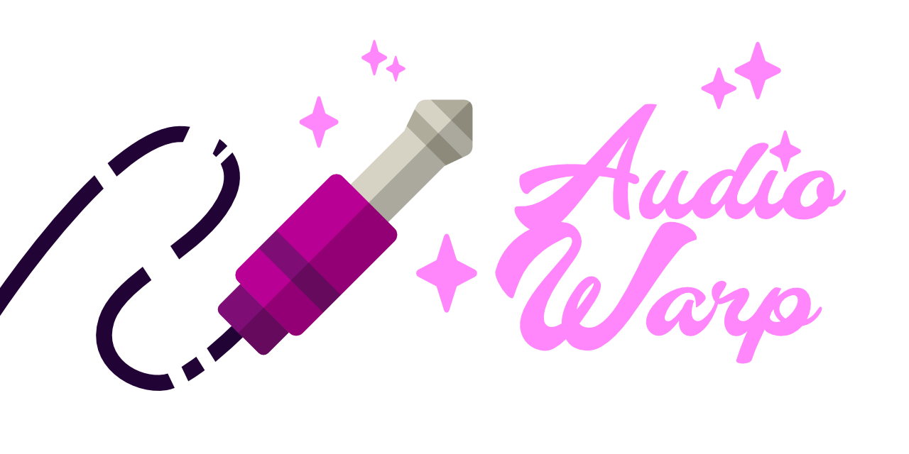
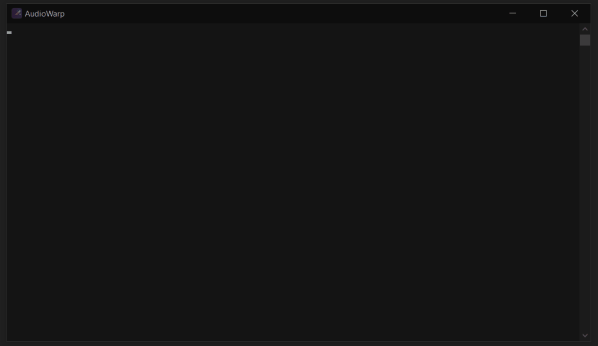
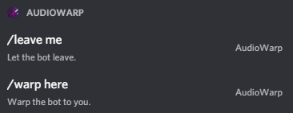
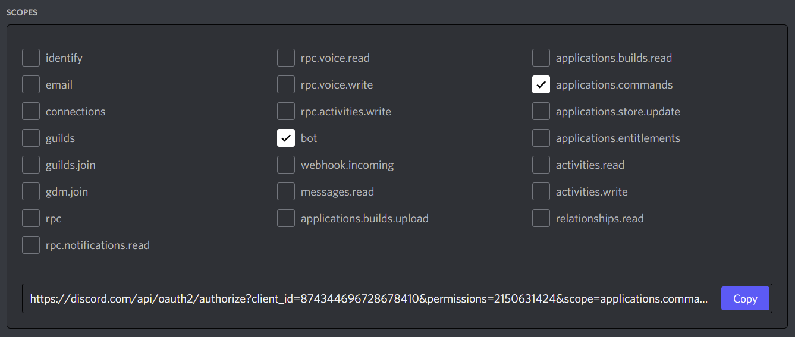
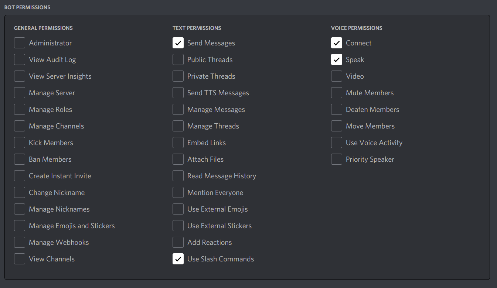

  

<h1 align="center"> AudioWarp </h1>

  <b>Warp your audio input device into Discord.</b>

 

  
  
  
  
  
  

AudioWarp is a [Discord](https://discord.com) bot inspired by the [radio bot example from discord.js](https://github.com/discordjs/voice/tree/main/examples/radio-bot).
It uses [FFmpeg](https://www.ffmpeg.org) to convert an audio input device into a stream that can be played via a Discord bot.
This allows to send an audio stream directly to Discord via their api instead of the standard discord client.
And therefore having much better audio quality for music. (e.g. playing an e-piano on Discord, maybe on
[stage channels](https://support.discord.com/hc/de/articles/1500005513722-Stage-Channels-FAQ))

## Usage
The build script inside the `package.json` builds an `.exe` for Windows.
It contains everything needed to start the application.
Just double-click it and AudioWarp boots up and asks some questions to operate correctly.
If you're done with it, just close the window.

  

Once the bot is running and invited on your sever, you can execute two commands to operate the bot.

  

## Build
To build the tool you have to have a Discord bot.
You can read on how to create on [here](https://discord.com/developers/docs/intro#bots-and-apps).
Get yourself a token and place in the root of the directory and name the file `.token`.
Upon building `caxa` will collect that `.token` file and insert it into the `.exe`, making the application complete.

*Note: Building this tool requires the go lang compiler.*

## Invite the bot
To invite the bot to your server you have to set the scopes and permissions correctly.

The scopes the bot needs:

  

And the perms the bot needs:

  

